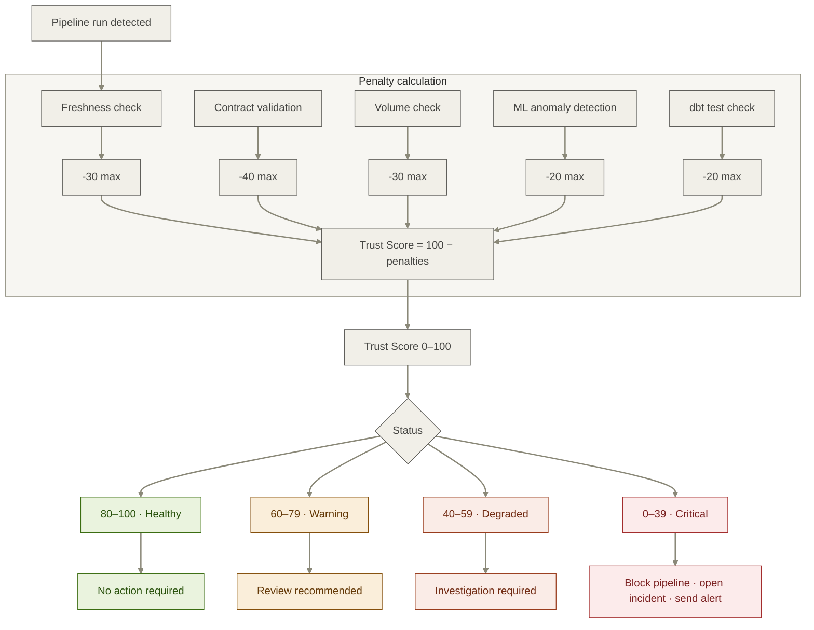
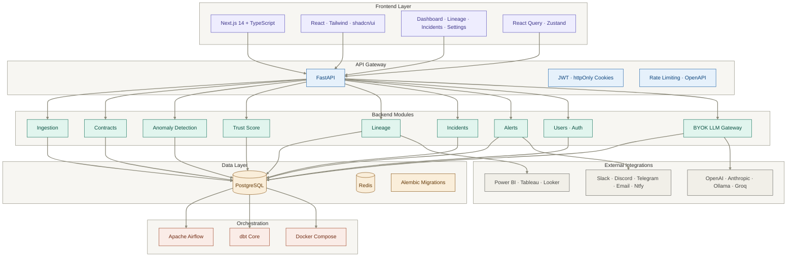

<div align="center">


[](LICENSE)
[](https://python.org)
[](https://airflow.apache.org)
[](https://getdbt.com)
[](https://fastapi.tiangolo.com)
[](https://nextjs.org)
[](https://docker.com)

**A single, explainable Trust Score for every dataset in your pipeline.**

Qolyx tells you whether your data can be trusted right now — and if not, exactly what broke, why, and what it affects.

[Quick Start](#quick-start) · [How It Works](#how-it-works) · [Trust Score](#trust-score) · [Architecture](#architecture) · [Comparison](#why-qolyx) · [Roadmap](#roadmap)

</div>

---

## The Problem

A pipeline can complete successfully, pass every dbt test, and still ship silently wrong data:

- A column gets renamed upstream and nothing downstream notices.
- A volume spike triples every metric overnight.
- A schema change quietly breaks a dozen downstream models.

By the time anyone catches it, a dashboard has already been shared or a decision has already been made. Existing tools either require significant licensing spend, demand hand-written rules for every check, or produce anomaly logs without answering the question that actually matters:

> **Can this data be trusted, right now?**

Qolyx answers that question automatically, for every dataset, on every run.

---

## How It Works

Qolyx sits alongside your existing stack. Each pipeline run passes through a fixed sequence of checks, ending in a freshly computed Trust Score:

```
Data Sources → Airflow → dbt → Contracts → Anomaly Engine → Trust Score → Incidents/Timeline → Alerts
```

Contracts run before anomaly detection and can block a pipeline outright. Lineage is traced in parallel. The Trust Score is recalculated on every run — never cached, never estimated.

```mermaid
graph LR
    subgraph Sources["Data Sources"]
        A1[("Finnhub")]
        A2[("FDA")]
        A3[("GitHub Archive")]
    end
    subgraph Orchestration["Orchestration"]
        B1["Airflow<br/>3 DAGs"]
        B2["dbt Core<br/>Bronze → Silver → Gold"]
    end
    subgraph Contracts["Contracts"]
        C1["Schema validation"]
        C2["Pipeline gate<br/>blocks on violation"]
    end
    subgraph Anomaly["Anomaly Engine"]
        D1["Isolation Forest"]
        D2["SHAP explainability"]
    end
    subgraph TrustScore["Trust Score"]
        E1["100 − penalties"]
    end
    subgraph Incidents["Incidents"]
        F1["Incident created"]
        F2["RCA generated"]
    end
    subgraph Alerts["Alerts"]
        G1["Slack / Discord / Teams"]
        G2["Telegram / Email / Ntfy"]
    end
    A1 --> B1
    A2 --> B1
    A3 --> B1
    B1 --> B2
    B2 --> C1
    C1 --> C2
    C2 --> D1
    D1 --> D2
    D2 --> E1
    E1 --> F1
    F1 --> F2
    F2 --> G1
    F2 --> G2

    style Sources fill:#F7F6F2,stroke:#8A8878,color:#2C2C2A
    style Orchestration fill:#F7F6F2,stroke:#8A8878,color:#2C2C2A
    style Contracts fill:#F7F6F2,stroke:#8A8878,color:#2C2C2A
    style Anomaly fill:#F7F6F2,stroke:#8A8878,color:#2C2C2A
    style TrustScore fill:#F7F6F2,stroke:#8A8878,color:#2C2C2A
    style Incidents fill:#F7F6F2,stroke:#8A8878,color:#2C2C2A
    style Alerts fill:#F7F6F2,stroke:#8A8878,color:#2C2C2A

    linkStyle default stroke:#8A8878,stroke-width:2px

    classDef source fill:#E6F1FB,stroke:#185FA5,color:#0C447C
    classDef orch fill:#EEEDFE,stroke:#534AB7,color:#3C3489
    classDef contract fill:#FAEEDA,stroke:#854F0B,color:#633806
    classDef anomaly fill:#E1F5EE,stroke:#0F6E56,color:#085041
    classDef trust fill:#FAECE7,stroke:#993C1D,color:#712B13
    classDef incident fill:#FCEBEB,stroke:#A32D2D,color:#791F1F
    classDef alert fill:#F1EFE8,stroke:#5F5E5A,color:#444441
    class A1,A2,A3 source
    class B1,B2 orch
    class C1,C2 contract
    class D1,D2 anomaly
    class E1 trust
    class F1,F2 incident
    class G1,G2 alert
```



---

## Trust Score

The Trust Score is Qolyx's core abstraction: one number, built from five independent, fully traceable signals.

```python
trust_score = 100
trust_score -= contract_penalty    # up to -40 (schema, type, nullability violations)
trust_score -= freshness_penalty   # up to -30 (hours since update vs. SLA)
trust_score -= volume_penalty      # up to -30 (row count deviation vs. 30-day baseline)
trust_score -= anomaly_penalty     # up to -20 (Isolation Forest, numeric columns)
trust_score -= dbt_penalty         # up to -20 (failed dbt model tests)
trust_score  = max(0, min(100, trust_score))
```

| Score  | Status       | Action                                              |
|--------|--------------|------------------------------------------------------|
| 80–100 | Healthy      | No action required                                   |
| 60–79  | Warning      | Review recommended                                   |
| 40–59  | Degraded     | Investigation required                               |
| 0–39   | Critical     | Pipeline quarantined, incident opened, alert sent    |

Every score change comes with a structured breakdown:

```json
{
  "dataset": "sales_transactions",
  "trust_score": 41,
  "previous_score": 91,
  "delta": -50,
  "status": "CRITICAL",
  "breakdown": {
    "contract_penalty": -10,
    "freshness_penalty": 0,
    "volume_penalty": -20,
    "anomaly_penalty": -13,
    "dbt_penalty": -7
  },
  "explanation": "Trust score dropped 91 -> 41. Row count exceeded baseline by 3,212%. Schema contract violated: column 'revenue_usd' not found. dbt uniqueness test failed on transaction_id. Statistical anomaly detected in revenue_usd.",
  "affected_assets": [
    "executive_revenue_dashboard",
    "monthly_finance_report",
    "ml_churn_model_features"
  ],
  "root_cause": "Duplicate records introduced in transactions.csv",
  "traced_to": "DAG 'ingest_transactions' modified 2 hours ago"
}
```



---

## Data Reliability Timeline

Every run produces a timestamped event narrative:

```
09:02:01  Pipeline started       sales_transactions · run_id: a4f7c2
09:02:04  Contract failed        Column 'revenue_usd' not found — schema drift
09:02:04  Trust Score            91 -> 81  (-10 contract penalty)
09:02:05  Anomaly detected       Row count 12,847 vs. expected 380-420
09:02:05  Trust Score            81 -> 41  (-20 volume, -13 anomaly, -7 dbt)
09:02:05  Lineage traced         3 downstream assets identified
09:02:06  Incident created       #47 · CRITICAL · RCA generated automatically
09:02:06  Timeline updated       6 events recorded
09:02:07  Alert dispatched       Slack #data-alerts, data-team@company.com
```

---

## Features

| Feature                   | Description                                                                       |
|----------------------------|-------------------------------------------------------------------------------------|
| Trust Score                | Single 0–100 reliability metric per dataset — explainable, never a black box.       |
| Zero rule writing          | ML learns your data's normal baseline automatically; no manual thresholds.          |
| Data contracts              | Enforce schema, type, and nullability agreements. Blocks pipelines on violation.    |
| ML anomaly detection        | Isolation Forest + SHAP explainability. Learns baseline within 7 days.              |
| Column-level lineage        | Traces individual columns from source to dashboard, with temporal time travel.      |
| BI dashboard mapping        | Connects to Power BI, Tableau, Looker, or a bundled mock BI for demos.              |
| Root cause analysis         | Plain-English RCA rather than raw anomaly scores.                                   |
| Multi-channel alerts        | Slack, Discord, Teams, Telegram, Email, and Ntfy.                                   |
| Reliability timeline        | Event-by-event history per dataset — replayable and auditable.                      |
| BYOK LLM gateway            | Bring your own OpenAI, Anthropic, Ollama, or Groq key for enhanced RCA.             |
| Authentication              | JWT with httpOnly cookies, bcrypt hashing, email verification, rate limiting.       |
| Built-in dashboards        | Qolyx includes a full dashboard UI for monitoring data quality.                    |
| Self-hostable                | Fully open source. Runs on your own infrastructure.                                 |

---

## Quick Start

### Requirements

- Docker + Docker Compose
- 8 GB RAM minimum, 10 GB free disk
- Mac/Linux: `make` · Windows: PowerShell 5.1+

### Run the Demo

```bash
git clone https://github.com/Ayush-kushwah/qolyx
cd qolyx

make demo          # Mac / Linux
.\demo.ps1         # Windows
```

| Service          | URL                             |
|-------------------|----------------------------------|
| Qolyx Dashboard    | http://localhost:5173           |
| Airflow            | http://localhost:8080           |
| API Docs           | http://localhost:8000/docs      |

The demo seeds three pipelines (financial, FDA, GitHub), injects six realistic failure scenarios, and walks the Trust Score down from 100 to 20 while generating incidents, RCA, and console-based alerts.

### First Login

| Credential | Value |
|------------|-------|
| Username   | `admin@qolyx.io` |
| Password   | `adminpassword123` |

> ⚠️ Please change the default password after first login.

### Connect Your Pipeline

```yaml
# contracts/my_pipeline.yaml

dataset: sales_transactions
source: postgresql
schedule: "@hourly"
sla_hours: 2

schema:
  - name: transaction_id   type: integer    nullable: false   unique: true
  - name: revenue_usd      type: float      nullable: false
  - name: customer_id      type: integer    nullable: false
  - name: created_at       type: timestamp  nullable: false

volume:
  min_rows: 300
  max_rows: 600
  baseline_days: 30
```

That's the full contract Qolyx needs to start monitoring a pipeline.

---

## Architecture



| Layer            | Description                                                              |
|--------------------|---------------------------------------------------------------------------|
| Data sources        | Finnhub, FDA, GitHub — or your own pipelines                             |
| Orchestration        | Apache Airflow schedules and triggers runs                               |
| Transformation        | dbt Core: bronze → silver → gold                                         |
| Contracts              | Schema validation; blocks pipelines on violation                         |
| Anomaly engine          | Isolation Forest + SHAP                                                  |
| Trust Score              | 0–100 score from five penalty signals                                    |
| Incidents & timeline       | RCA generation, event timeline, severity grading                     |
| Alerts                       | Slack, Discord, Teams, Telegram, Email, Ntfy                         |

### Technology Stack

| Layer            | Technology                                       | Purpose                                             |
|--------------------|---------------------------------------------------|------------------------------------------------------|
| Frontend             | Next.js 14, TypeScript                           | Dashboard, lineage explorer, incident view            |
| Backend               | FastAPI, Python 3.11                              | REST API, business logic, event orchestration          |
| Orchestration           | Apache Airflow                                  | Scheduling, retries, dependency management              |
| Transformation            | dbt Core                                      | Bronze → silver → gold, with built-in tests               |
| Database                    | PostgreSQL, Alembic                         | Primary store with schema migrations                        |
| Queue                         | Redis                                     | Background tasks, rate limiting, event bus                     |
| Auth                             | JWT, bcrypt                             | Authentication and session management                             |
| ML / anomaly                       | scikit-learn (Isolation Forest), SHAP | Statistical anomaly detection and explainability                     |
| Lineage                               | sqlglot, OpenLineage                | Column-level lineage, temporal time travel                             |
| BI connectors                            | Power BI, Tableau, Looker, Mock   | Dashboard mapping and impact analysis                                    |
| LLM gateway                                 | BYOK (OpenAI, Anthropic, Ollama, Groq) | Enhanced RCA using the user's own key                                |
| Infrastructure                                 | Docker Compose                        | Local development and demo environment                                  |

### Project Structure

```
qolyx/
├── backend/
│   ├── modules/
│   │   ├── ingestion/           # Source connectors and Airflow adapters
│   │   ├── profiling/           # Dataset baseline learning and statistics
│   │   ├── anomaly_detection/   # Isolation Forest, SHAP, volume checks
│   │   ├── contracts/           # Schema validation and pipeline gating
│   │   ├── lineage/             # Column-level lineage, temporal tracking
│   │   ├── trust_scoring/       # Core scoring engine
│   │   ├── incidents/           # Incident lifecycle and RCA generation
│   │   ├── alerts/              # Slack, Discord, Telegram, Email, Ntfy
│   │   ├── users/               # User management, sessions, authentication
│   │   └── llm/                 # BYOK LLM gateway
│   ├── api/                     # FastAPI routes — no business logic
│   └── core/                    # Config, database session, event bus
├── frontend/                    # Next.js dashboard
├── dbt_project/                 # Bronze → silver → gold models
├── airflow_dags/                # Pipeline DAG definitions
├── infra/                       # Docker Compose, Prometheus
├── demo/                        # Synthetic data, scenarios, one-command demo
└── tests/                       # Full test suite (82+ tests passing)
```

---

## Why Qolyx

|                              | Monte Carlo | Great Expectations | Soda Core | Qolyx |
|-------------------------------|-------------|----------------------|-----------|-------|
| Open source                    | No          | Yes                  | Yes       | Yes   |
| Zero rule writing                | Yes       | No                   | No        | Yes   |
| Single trust score                 | No      | No                   | No        | Yes   |
| Explainable scoring                   | No   | No                   | No        | Yes   |
| Pipeline-blocking contracts               | Yes | Yes                  | Yes       | Yes   |
| Column-level lineage                        | No | No                   | No        | Yes   |
| BI dashboard mapping                           | No | No                  | No        | Yes   |
| Plain-English RCA                                 | No | No                | No        | Yes   |
| Self-hostable                                       | No | Yes             | Yes       | Yes   |
| BYOK LLM gateway                                       | No | No           | No        | Yes   |

*Comparison reflects publicly documented features as of this writing and is provided for orientation, not as an independent audit.*

---

## Roadmap

Development happens in public; each phase is git-tagged.

| Phase | Description                                                     | Status         |
|-------|-------------------------------------------------------------------|----------------|
| 1     | Repository structure, Docker skeleton, project foundation           | Complete       |
| 2     | Backend skeleton — FastAPI, Alembic migrations                        | Complete       |
| 3     | Ingestion + bronze layer — Airflow DAGs, raw data loading                | Complete       |
| 4     | dbt transformations — bronze → silver → gold, CI/CD                        | Complete       |
| 5     | Contracts module — schema validation, pipeline gating                        | Complete       |
| 6     | Profiling + anomaly engine — baseline learning, Isolation Forest, SHAP          | Complete       |
| 7     | Trust Score system — core scoring engine, explainability                          | Complete       |
| 8     | Incidents + timeline — RCA generation, severity grading                              | Complete       |
| 9     | Lineage tracking — column-level, temporal time travel                                   | Complete       |
| 10    | Frontend dashboards — Next.js, dark mode, real-time updates                                | Complete       |
| 11    | One-command demo — `make demo` / `.\demo.ps1`                                                | Complete       |
| 12    | Open source launch — docs, contribution guide, community                                       | In progress    |

---

## Contributing

Contributions are welcome.

```bash
git clone https://github.com/YOUR_USERNAME/qolyx
cd qolyx

make demo                                       # run the demo
docker compose exec qolyx-backend pytest        # run tests
docker compose -f infra/compose.yaml up -d      # start dev environment
```

See [CONTRIBUTING.md](CONTRIBUTING.md) for full guidelines.

---

## License

[MIT License](LICENSE) — free to use, modify, and distribute, with attribution.

---

<div align="center">

Built by [Ayush Kushwah](https://github.com/Ayush-kushwah) · [LinkedIn](https://www.linkedin.com/in/ayush-kushwah-070284228)

If Qolyx helps you trust your data, consider starring the repo.


</div>
