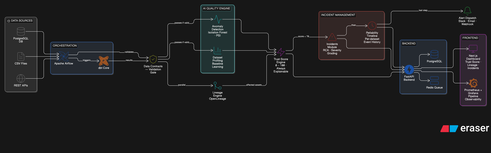
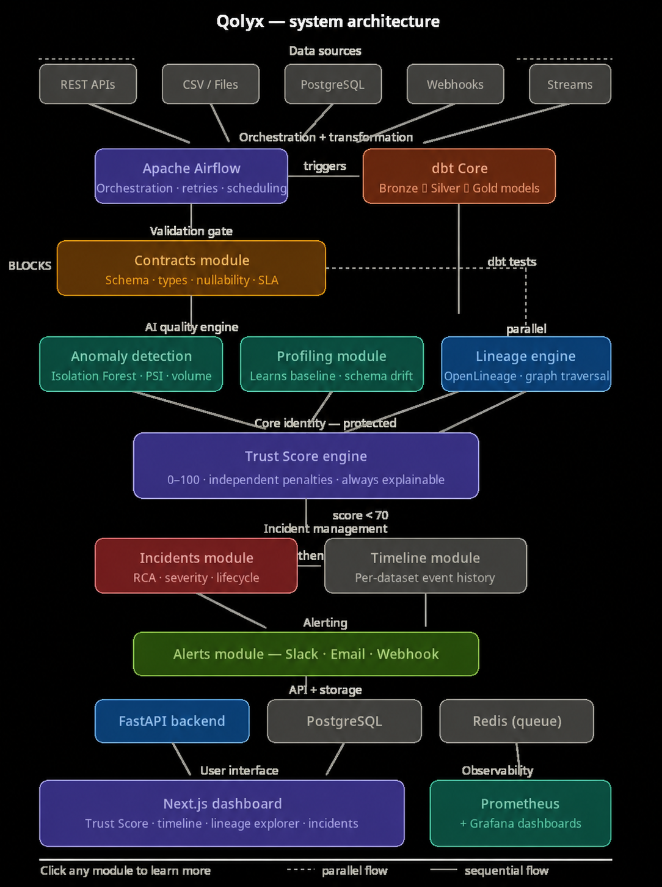

<div align="center">


<br/>

[](LICENSE)
[](https://python.org)
[](https://airflow.apache.org)
[](https://getdbt.com)
[](https://fastapi.tiangolo.com)
[](https://nextjs.org)
[](https://docker.com)

<br/>

**Your pipelines run. But can you trust what they produce?**

Qolyx gives every dataset a **Trust Score** — a single explainable number from 0 to 100 that tells you whether your data can be trusted, why it changed, and exactly what broke.

<br/>

[**Get Started**](#quick-start) · [**How It Works**](#how-it-works) · [**Trust Score**](#trust-score) · [**Architecture**](#architecture) · [**Compare**](#why-qolyx) · [**Build Status**](#build-status)

<br/>

</div>

---

## The Problem

```
Pipeline status:   ✅  completed successfully
dbt tests:         ✅  all passed
Data quality:      ❌  silently wrong
```

Every data team has this nightmare. A pipeline runs successfully. Data loads into the warehouse. Dashboards update. Business decisions get made. Three days later — the numbers were wrong.

A column was silently renamed upstream. A volume spike tripled every metric. A schema change broke 12 downstream models. Nobody noticed until the finance team presented incorrect quarterly results to the board.

Existing solutions are expensive ($50,000+/year), require manual rule writing for every check, or produce walls of anomaly logs without answering the only question that matters:

> **"Can I trust this data — right now?"**

Qolyx answers that question. Automatically. For every dataset. Every run.

---

## How It Works

Qolyx wraps around your existing stack. Every pipeline run passes through 8 sequential steps — from ingestion to alert — with a Trust Score calculated at the end of each run.

<!-- Architecture diagram — replace with your exported Eraser.io image -->


> **Data Sources → Airflow → dbt → Contracts → Anomaly Engine → Trust Score → Incidents + Timeline → Alerts**

Each step is mandatory and sequential. Contracts block the pipeline before anomaly detection runs. Lineage traces in parallel. Trust Score is calculated fresh every run — never cached, never estimated.

---

## Trust Score

The Trust Score is the central identity of Qolyx. A single number that reflects five independent signals — always explainable, always traceable.

```python
trust_score = 100
trust_score -= contract_penalty    # max −40  (schema, types, nullability violations)
trust_score -= freshness_penalty   # max −30  (hours since update vs SLA)
trust_score -= volume_penalty      # max −30  (row count deviation from 30-day baseline)
trust_score -= anomaly_penalty     # max −20  (Isolation Forest — numeric columns only)
trust_score -= dbt_penalty         # max −20  (failed dbt model tests)
trust_score  = max(0, min(100, trust_score))
```

| Score | Status | What Happens |
|---|---|---|
| 80–100 | 🟢 **HEALTHY** | No action required |
| 60–79 | 🟡 **WARNING** | Review recommended |
| 40–59 | 🟠 **DEGRADED** | Investigation required |
| 0–39 | 🔴 **CRITICAL** | Pipeline quarantined · Incident created · Alert dispatched |

Every score change returns a structured, human-readable breakdown:

```json
{
  "dataset": "sales_transactions",
  "trust_score": 41,
  "previous_score": 91,
  "delta": -50,
  "status": "CRITICAL",
  "breakdown": {
    "contract_penalty": -10,
    "freshness_penalty": 0,
    "volume_penalty": -20,
    "anomaly_penalty": -13,
    "dbt_penalty": -7
  },
  "explanation": "Trust score dropped 91 → 41. Row count exceeded baseline by 3,212%. Schema contract violated: column 'revenue_usd' not found. dbt uniqueness test failed on transaction_id. Statistical anomaly in revenue_usd column.",
  "affected_assets": [
    "executive_revenue_dashboard",
    "monthly_finance_report",
    "ml_churn_model_features"
  ],
  "root_cause": "Duplicate records introduced in transactions.csv",
  "traced_to": "DAG 'ingest_transactions' modified 2 hours ago"
}
```

---

## Data Reliability Timeline

Every pipeline run produces a timestamped event narrative — not just a log, a story:

```
09:02:01  ▶  Pipeline started          sales_transactions · run_id: a4f7c2
09:02:04  ✗  Contract failed           Column 'revenue_usd' not found — schema drift
09:02:04  ↓  Trust Score              91 → 81  (−10 contract penalty)
09:02:05  ✗  Anomaly detected         Row count: 12,847 · Expected: 380–420
09:02:05  ↓  Trust Score              81 → 41  (−20 volume · −13 anomaly · −7 dbt)
09:02:05  ⑂  Lineage traced           3 downstream assets identified
09:02:06  ⚠  Incident created         #47 · CRITICAL · RCA generated automatically
09:02:06  ✓  Timeline updated         6 events recorded
09:02:07  ✉  Alert dispatched         Slack #data-alerts · data-team@company.com
```

---

## Features

| Feature | Description |
|---|---|
| **Trust Score** | Single 0–100 reliability metric per dataset. Always explainable. Never black-box. |
| **Zero Rule Writing** | AI learns what normal looks like from your data automatically. No manual thresholds needed. |
| **Data Contracts** | Enforce schema, type, and nullability agreements. **Block** pipelines on violation — not just alert. |
| **AI Anomaly Detection** | Isolation Forest + PSI + volume checks. Learns your baseline in 7 days. Works on any numeric column. |
| **Data Lineage** | OpenLineage integration. Traces every column to its source. Shows every downstream asset affected by an incident. |
| **Root Cause Analysis** | Plain English. Not "anomaly_score: 0.94" — "revenue column has 3,212% more rows than expected, traced to DAG modified 2 hours ago." |
| **Reliability Timeline** | Event-by-event story per dataset. Replayable, auditable, shareable. |
| **Observability** | Prometheus metrics + Grafana dashboards for pipeline health, DQ scores, and SLA tracking. |
| **make demo** | One command. Full platform. Synthetic pipelines. Auto-injected failures. Live Trust Score collapse. Under 5 minutes. |

---

## Quick Start

### Requirements

- Docker + Docker Compose
- 8 GB RAM minimum
- 10 GB free disk space

### Run the Demo

```bash
git clone https://github.com/Ayush-kushwah/qolyx
cd qolyx
make demo
```

Then open:

| Service | URL |
|---|---|
| Qolyx Dashboard | http://localhost:3000 |
| Airflow | http://localhost:8080 |
| Grafana | http://localhost:3001 |
| API Docs | http://localhost:8000/docs |

The demo automatically seeds 3 synthetic pipelines (sales, inventory, weather), injects realistic failures — schema drift, null explosion, volume spike, freshness delay — and shows Trust Scores collapsing in real time with incidents, RCA, and alerts.

### Connect Your Pipeline

```yaml
# contracts/my_pipeline.yaml

dataset: sales_transactions
source: postgresql
schedule: "@hourly"
sla_hours: 2

schema:
  - name: transaction_id   type: integer    nullable: false   unique: true
  - name: revenue_usd      type: float      nullable: false
  - name: customer_id      type: integer    nullable: false
  - name: created_at       type: timestamp  nullable: false

volume:
  min_rows: 300
  max_rows: 600
  baseline_days: 30
```

That is everything Qolyx needs to start monitoring your pipeline.

---

## Architecture

<!-- System design diagram — replace with your exported Eraser.io image -->


### Technology Stack

| Layer | Technology | Purpose |
|---|---|---|
| Orchestration | Apache Airflow | Pipeline scheduling, retries, dependency management |
| Transformation | dbt Core | Bronze → Silver → Gold models with built-in tests |
| Contracts | Custom engine | Schema enforcement, pipeline gating |
| Anomaly Detection | scikit-learn (Isolation Forest) | Statistical anomaly detection, baseline learning |
| Lineage | OpenLineage | Dataset lineage tracking and graph storage |
| Backend | FastAPI + Python 3.11 | REST API, business logic, event orchestration |
| Database | PostgreSQL + Alembic | Primary data store with schema migrations |
| Queue | Redis | Background task and worker management |
| Frontend | Next.js 14 + TypeScript | Dashboard, lineage explorer, incident view |
| Observability | Prometheus + Grafana | Platform and pipeline health monitoring |
| Infrastructure | Docker Compose | Local development and demo environment |

### Project Structure

```
qolyx/
├── backend/
│   ├── modules/
│   │   ├── ingestion/           # Source connectors and Airflow adapters
│   │   ├── profiling/           # Dataset baseline learning and statistics
│   │   ├── anomaly_detection/   # Isolation Forest, PSI, volume checks
│   │   ├── contracts/           # Schema validation and pipeline gating
│   │   ├── lineage/             # OpenLineage integration and graph storage
│   │   ├── trust_scoring/       # Core scoring engine — protected
│   │   ├── incidents/           # Incident lifecycle and RCA generation
│   │   ├── timeline/            # Per-dataset event history
│   │   └── alerts/              # Slack, email, and webhook dispatch
│   ├── api/                     # FastAPI routes — no business logic
│   └── core/                    # Config, database session, event bus
├── frontend/                    # Next.js 14 dashboard
├── dbt_project/                 # Bronze → Silver → Gold models
├── airflow_dags/                # Pipeline DAG definitions
├── infra/                       # Docker Compose, Prometheus, Grafana
├── demo/                        # Synthetic data and failure injection
└── tests/                       # Full test suite
```

---

## Why Qolyx

| | Monte Carlo | Great Expectations | Soda Core | **Qolyx** |
|---|---|---|---|---|
| Open source | ❌ | ✅ | ✅ | ✅ |
| Zero rule writing | ✅ | ❌ | ❌ | ✅ |
| Single Trust Score | ❌ | ❌ | ❌ | ✅ |
| Explainable scoring | ❌ | ❌ | ❌ | ✅ |
| Pipeline blocking contracts | ✅ | ✅ | ✅ | ✅ |
| Data lineage | ✅ | ❌ | ❌ | ✅ |
| Plain English RCA | ❌ | ❌ | ❌ | ✅ |
| Self-hostable | ❌ | ✅ | ✅ | ✅ |
| One-command demo | ❌ | ❌ | ❌ | ✅ |
| Price | $50K+/yr | Free | Free | **Free** |

---

## Build Status

> Building in public. Every phase is git-tagged. Star to follow progress. ⭐

| Phase | Status | Description |
|---|---|---|
| Phase 1 — Repository + Governance | ✅ Complete | Repo structure, Docker skeleton, project foundation |
| Phase 2 — Backend Skeleton | ✅ Complete | FastAPI, Alembic migrations, database foundation |
| Phase 3 — Ingestion + Bronze Layer | ✅ Complete | 3 Airflow DAGs, raw data loading, error handling |
| Phase 4 — dbt Transformations | 🔄 In Progress | Bronze → Silver → Gold, CI/CD for models |
| Phase 5 — Contracts Module | ⏳ Pending | Schema validation, pipeline gating, YAML contracts |
| Phase 6 — Profiling + Anomaly Engine | ⏳ Pending | Baseline learning, Isolation Forest, PSI |
| Phase 7 — Trust Score System | ⏳ Pending | Core scoring engine, explainability breakdown |
| Phase 8 — Incidents + Timeline | ⏳ Pending | RCA generation, event timeline, severity grading |
| Phase 9 — Lineage Tracking | ⏳ Pending | OpenLineage, graph traversal, affected assets API |
| Phase 10 — Frontend Dashboards | ⏳ Pending | Next.js, D3 lineage explorer, real-time updates |
| Phase 11 — make demo | ⏳ Pending | One-command full platform demo experience |
| Phase 12 — Open Source Launch | ⏳ Pending | Docs, contribution guide, community |

---

## Contributing

Contributions are welcome once Phase 3 is complete.

```bash
# Fork and clone
git clone https://github.com/YOUR_USERNAME/qolyx

# Install dev dependencies
make install-dev

# Run tests
make test

# Start dev environment
make dev
```

See [CONTRIBUTING.md](CONTRIBUTING.md) for full guidelines.

---

## License

[MIT License](LICENSE) — free to use, modify, and distribute. Attribution required.

---

<div align="center">

<br/>

Built by [**Ayush Kushwah**](https://github.com/Ayush-kushwah) &nbsp;·&nbsp; [LinkedIn](https://www.linkedin.com/in/ayush-kushwah-070284228)

<br/>

*If Qolyx helps you trust your data, give it a* ⭐

<br/>


</div>
